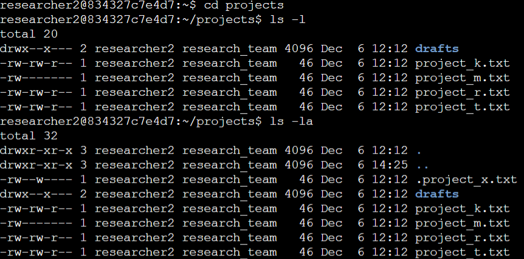
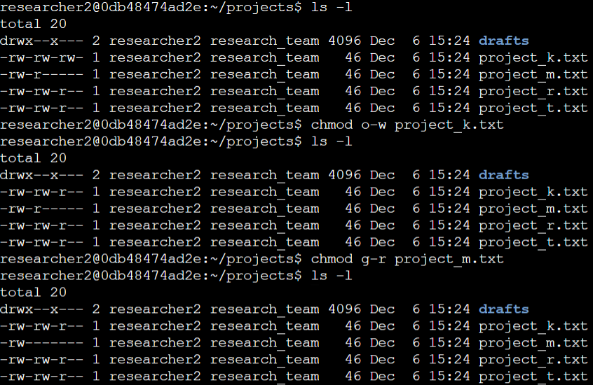
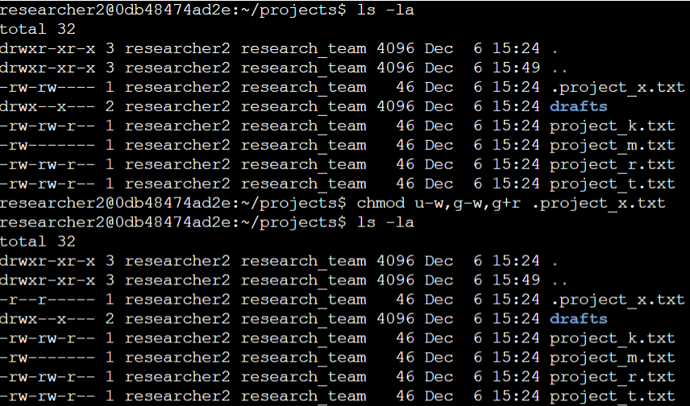

# **Project Description**

In this lab activity, I was required to audit and correct file and directory permissions in the `projects` directory. Some permissions were misconfigured, allowing more access than intended. To strengthen security, I reviewed the existing settings and updated them as needed. Below is an overview of the steps I performed:

# **Task 1: Check file and Directory Details** 

The following code demonstrates how I used Linux commands to determine the existing permissions set for a specific directory in the file system.

When I first checked the contents of the `projects` directory, I started with the `ls -l` command. The first line in the screenshot shows the exact command I ran, and everything below it is the output. The `ls -l` command gives a detailed listing of all _visible_ files and directories, including their permissions, the file owner, thr group owner, file sizes, and timestamps. 

### Describe the Permission Strings

Right after running `ls -l`, I took a closer look at the permission strings. Each item begins with a 10 character string (for example: `-rw-rw-r--` or `drwx--x---`). These characters represent permissions for three categories of users: 

- **User** - the owner of the file (in this lab, the user is `researcher2`)
- **Group** - the group the file belongs to (`research_team`)
- **Other** - anyone else on the system who is not the user or in the group

Understanding this breakdown helped me interpret who currently has read, write, or execute access for each file. It's important to analyze this before making any permission changes later in the lab.

After reviewing the visible files, I needed to check whether any hidden files were present. To do that, I used `ls -la`. The `-a` option reveals hidden files, these are files that begin with a dot (`.`) and don't appear with a regular `ls` command. Using `ls -la` showed me a hidden file named `.project_x.txt` that wasn't visible earlier. 

From the full output of `ls -la`, I identified: 

- One directory: `drafts/`
- One hidden file: `.project_x.txt`
- Five regular project files 

# **Task 2: Change File Permissions** 

In this part of the lab, the goal was to check whether any files in the `projects` directory had permission settings that allowed **other** users (basically anyone outside the file's owner or group) to write to them. Allowing "other" users to write to files is a security risk, so the next step was to fix any incorrect permissions using the `chmod` command. 

I started by running `ls -l`, this let me review the permission strings for each file. The last three characters of the 10 character permission string represent the permissions for **other** users. If the third character in that group is `w`, it means "other" users can write to the file, which should *not* be allowed in this lab. 

From the output I noticed that: 
- `project_k.txt` had the permissions: `-rw-rw-rw-` the last `w` in this string shows that **other** has write access.

This is exactly the kind of permissions we need to remove. 

### Remove write permissions for "other" on `project_k.txt`

To fix the permissions, I used the `chmod` command with the `o-w` option. Then I ran `ls -l` again to confirm the change. The updated permissions string showed: `-rw-rw-r--`. This confirms that **other** users no longer have write access. 

### Check if the group has read or write permissions on `project_m.txt`

Next, the lab required tightening the permissions on `project_m.txt`. This file is considered **restricted**, meaning only the user should be able to read or modify it, not the group and not other users. 

Currently, the permissions are `--rw-r-----`. This tells me the user has read and write access, group has read access, and other has no access. 

### Remove read access for the group on `project_m.txt`

To remove read permissions from the group I used: `chmod g-r project_m.txt`. After running `ls -l` one more time, the updated permissions were: `-rw------`. Now only the user can read and write this file, and both group and other have no permissions, which matches the requirement for a restricted file. 

# **Task 3: Change Permissions on a Hidden File**
In this part of the lab, I worked with a hidden file named `.project_x.txt`. Hidden files in Linux begin with a dot (`.`) and are often used for configuration or archived data. Because this file has been archived, the lab instructions state that **no one should be able to write to it**, but both the user and group should still be able to read it. 

This means the final permissions should allow: 
- User --> read only 
- Group --> read only 
- Other --> no permissions

### Check the current permissions of `.project_x.txt`

To view the hidden the file's permissions I ran `ls -la` (the `-a` option makes hidden files visible). From the output, I looked at the permission string next to the file and it showed `-rw-r----`. The user is allowed to write to it which is not allowed for an archived file. 

### Remove the write permissions from user and ensure the group only has read access 

I used `chmod u-w,g-w,g+r .project_x.txt` to remove write permissions from the user and group as well as ensure the group still has read access. The updated permissions now look like `-r--r----`. 

Which means: 

- user --> read only
- group --> read only 
- other --> no access 